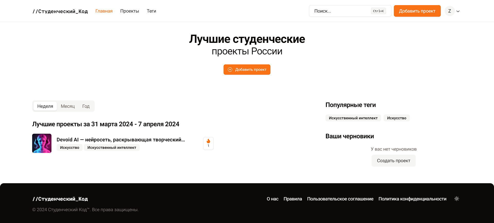

## Student Code

Client web-application for a platform for publishing student projects.

Stack: TypeScript, React, Next.js, NextAuth, TanStack Query, React Hook Form, Zod, Tailwind CSS, Radix UI, shadcn/ui and Storybook.

#### Links:

- [General](https://studcode.ru)

- [Storybook](https://main--65ae8c0861744a8063791c15.chromatic.com/)

---

Hosted on [Vercel](https://vercel.com).

Created by: Otkhonov Bair KTbo4-8
